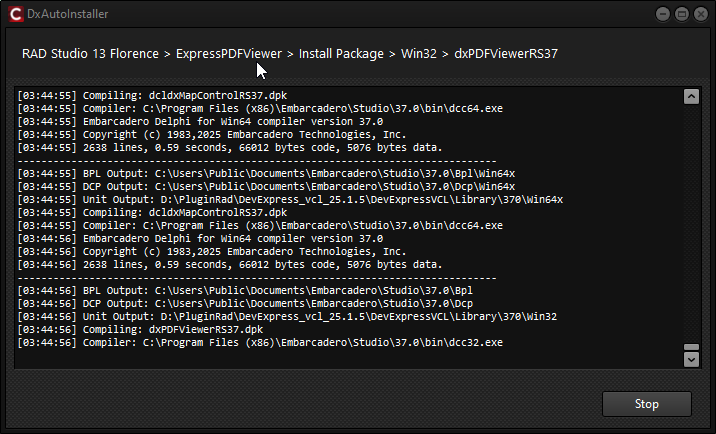
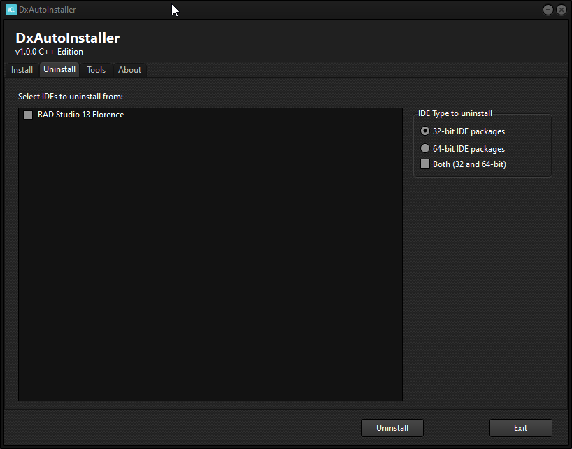

# DxAutoInstaller C++ Edition

**Version 2.0.0** (December 2025)

## Screenshots

<p align="center">
  
  <br><em>Install Tab / Вкладка установки</em>
</p>

<p align="center">
  
  <br><em>Installation Progress / Процесс установки</em>
</p>

<p align="center">
  
  <br><em>Uninstall Tab / Вкладка удаления</em>
</p>

---

## 🇬🇧 English

DevExpress VCL Components Automatic Installer — completely rewritten in C++Builder.

### ✨ Features

- **No JCL dependency** — direct Windows Registry access
- **No DevExpress UI dependency** — standard VCL components only
- **RAD Studio 12/13+ support** — BDS 23.0 (Athens) and BDS 37.0 (Florence)
- **64-bit IDE support** — design-time packages for both 32-bit and 64-bit IDE
- **Win64 Modern (Win64x)** — full support with COFF .lib generation via `-jf:coffi` flag
- **Async threading** — responsive UI during compilation, instant Stop button
- **C++ paths registration** — System Include Path and Library Path for all platforms
- **Classic & Modern compilers** — paths registered for both Win32 compilers
- **DevExpress VCL 25.1.x** — full support
- **Clean uninstall** — complete removal of all compiled files and registry entries

### 🆕 What's New in v2.0.0

- **Asynchronous installation** — UI stays responsive during compilation
- **Win64x separate compilation** — proper COFF .lib files with `-jf:coffi` flag
- **C++ Include/Library paths** — automatic registration for all platforms
- **Win32 Classic compiler support** — paths for both Modern (bcc32c) and Classic (bcc32)
- **Improved logging** — detailed logs for debugging
- **Better error handling** — graceful stop and error recovery

### 🚀 Target Platform Options

| Option | Description |
|--------|-------------|
| Win32 | Runtime packages for 32-bit applications |
| Win64 | Runtime packages for 64-bit applications (ELF format .a) |
| Win64x | Runtime packages for Win64 Modern (COFF format .lib) |

### 📋 Compilation Strategy

**Three separate compilations for C++Builder:**
- **Win32**: `dcc32 -JL` → `.dcu`, `.hpp`, `.lib` (OMF)
- **Win64**: `dcc64 -JL` → `.dcu`, `.hpp`, `.a` (ELF)
- **Win64x**: `dcc64 -JL -jf:coffi` → `.dcu`, `.hpp`, `.lib` (COFF)

### 🔧 C++ Paths Registration

Automatically registers paths in IDE for all platforms:

| Path Type | Registry Location |
|-----------|-------------------|
| Delphi Search Path | `Library\{Platform}\Search Path` |
| Delphi Browsing Path | `Library\{Platform}\Browsing Path` |
| C++ Include Path | `C++\Paths\{Platform}\IncludePath` |
| C++ Library Path | `C++\Paths\{Platform}\LibraryPath` |
| C++ Classic (Win32) | `C++\Paths\Win32\Classic\*` |

### 🛠️ Building

1. Open `DxAutoInstaller.cbproj` in RAD Studio 12+
2. Select Win64 Modern (Clang) platform
3. Build

**Tested:** RAD Studio 13 Florence, Win64 Modern (x64 Clang).

---

## 🇷🇺 Русский

Автоматический установщик компонентов DevExpress VCL — полностью переписан на C++Builder.

### ✨ Возможности

- **Без зависимости от JCL** — прямой доступ к Windows Registry
- **Без зависимости от DevExpress UI** — только стандартные VCL компоненты
- **Поддержка RAD Studio 12/13+** — BDS 23.0 (Athens) и BDS 37.0 (Florence)
- **Поддержка 64-bit IDE** — design-time пакеты для 32-bit и 64-bit IDE
- **Win64 Modern (Win64x)** — полная поддержка с генерацией COFF .lib через флаг `-jf:coffi`
- **Асинхронная работа** — отзывчивый UI во время компиляции, мгновенная кнопка Stop
- **Регистрация C++ путей** — System Include Path и Library Path для всех платформ
- **Classic & Modern компиляторы** — пути для обоих Win32 компиляторов
- **DevExpress VCL 25.1.x** — полная поддержка
- **Чистое удаление** — полное удаление всех файлов и записей реестра

### 🆕 Что нового в v2.0.0

- **Асинхронная установка** — UI остаётся отзывчивым во время компиляции
- **Отдельная компиляция Win64x** — правильные COFF .lib файлы с флагом `-jf:coffi`
- **C++ Include/Library пути** — автоматическая регистрация для всех платформ
- **Поддержка Win32 Classic компилятора** — пути для Modern (bcc32c) и Classic (bcc32)
- **Улучшенное логирование** — детальные логи для отладки
- **Улучшенная обработка ошибок** — корректная остановка и восстановление

### 🚀 Опции целевых платформ

| Опция | Описание |
|-------|----------|
| Win32 | Runtime пакеты для 32-bit приложений |
| Win64 | Runtime пакеты для 64-bit приложений (ELF формат .a) |
| Win64x | Runtime пакеты для Win64 Modern (COFF формат .lib) |

### 📋 Стратегия компиляции

**Три отдельные компиляции для C++Builder:**
- **Win32**: `dcc32 -JL` → `.dcu`, `.hpp`, `.lib` (OMF)
- **Win64**: `dcc64 -JL` → `.dcu`, `.hpp`, `.a` (ELF)
- **Win64x**: `dcc64 -JL -jf:coffi` → `.dcu`, `.hpp`, `.lib` (COFF)

### 🔧 Регистрация C++ путей

Автоматически регистрирует пути в IDE для всех платформ:

| Тип пути | Расположение в реестре |
|----------|------------------------|
| Delphi Search Path | `Library\{Platform}\Search Path` |
| Delphi Browsing Path | `Library\{Platform}\Browsing Path` |
| C++ Include Path | `C++\Paths\{Platform}\IncludePath` |
| C++ Library Path | `C++\Paths\{Platform}\LibraryPath` |
| C++ Classic (Win32) | `C++\Paths\Win32\Classic\*` |

### 🛠️ Сборка

1. Откройте `DxAutoInstaller.cbproj` в RAD Studio 12+
2. Выберите платформу Win64 Modern (Clang)
3. Build

**Проверено:** RAD Studio 13 Florence, платформа Win64 Modern (x64 Clang).

---

## 📁 Directory Structure / Структура директорий

```
Library\
├── Sources\              # ALL sources (.pas, .dfm, .res, .dcr)
│
├── 370\                  # RAD Studio 13 compiled files
│   ├── Win32\            # Win32 platform
│   │   ├── *.dcu         # Compiled units
│   │   ├── *.hpp         # C++ headers
│   │   └── *.res         # Resources
│   ├── Win64\            # Win64 platform (ELF)
│   │   ├── *.dcu
│   │   ├── *.hpp
│   │   └── *.res
│   └── Win64x\           # Win64 Modern (COFF)
│       ├── *.dcu
│       ├── *.hpp
│       └── *.res
│
Dcp\                      # Public Documents\Embarcadero\Studio\37.0\Dcp
├── *.dcp, *.bpi, *.lib   # Win32 packages
├── Win64\                # Win64 packages (.a)
└── Win64x\               # Win64x packages (.lib COFF)

Bpl\                      # Public Documents\Embarcadero\Studio\37.0\Bpl
├── *.bpl                 # Win32 runtime packages
├── Win64\*.bpl           # Win64 runtime packages
└── Win64x\*.bpl          # Win64x runtime packages
```

## 📝 Logging

Log files created next to executable:
- Detailed log: `DD_MM_YYYY_HH_MM.log`
- Summary log: `DxAutoInstaller.log`

---

## 📜 License / Лицензия

This software is distributed **free of charge** (Freeware).

When redistributing, both authors must be credited:

- **Original Delphi version**: [Delphier](https://github.com/Delphier/DxAutoInstaller)
- **C++ Edition**: Platon

## 👏 Credits & Acknowledgments

Special thanks to **Delphier** for the original Delphi version of DxAutoInstaller!

## 📧 Contact

**Platon**
- Email: vteme777@gmail.com
- GitHub: [@Platon7788](https://github.com/Platon7788)

## ☕ Support / Поддержка

If this program was useful — I would be very grateful for your support!

- **PayPal**: vteme777@gmail.com

---

**DxAutoInstaller C++ Edition v2.0.0** © 2025 Platon

Based on original work by [Delphier](https://github.com/Delphier/DxAutoInstaller)
